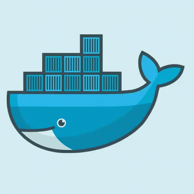

<h1 align="center">
   

</h1>

<em>Software Engineer Student at <a href="http://eng.cu.edu.eg/en/page/36/?s=8+">Cairo University faculty of engineering </a> 
</em>

***
### Software Engineer 
- 🔭 I’m currently working on enhancing my skills in Software Development :computer:
- 🌱 I’m currently learning about advanced algorithms and data structures.
- 👯 I’m looking to collaborate with other Software Engineers on interesting projects :rocket:
- 🥅 2024 Goals: Contribute to impactful open-source projects and enhance my expertise in cloud technologies.
- 💬 Ask me about software architecture, design patterns, or coding best practices! I'm here to help :raised_hands:
- 📬 Connect with me on [LinkedIn](www.linkedin.com/in/ahmed-fathy-742352253).
- 🧗 I strive to constantly innovate and improve, pushing the boundaries of what's possible in software engineering.
- ⚡ Fun fact: I'm passionate about exploring new technologies and love a good coding challenge! :nerd_face:
- 🌐 Check out my personal portfolio at [Ahmed's Portfolio](https://ahmed-portfolio-swart-kappa.vercel.app/)

 

---

**Languages and Tools:**

  

<!--
-->

<!---->

 

 
 
 
 

      
  

---

**Github Stats:**

  

    
     
    
  

---

  

---
