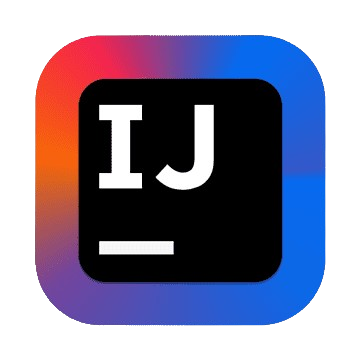

<h1 align="center">
  
</h1>

  

<em>
  Software Engineering Student at <a href="http://eng.cu.edu.eg/en/page/36/?s=8+">Cairo University, Faculty of Engineering</a> 
</em>

---

### 👨‍💻 About Me

- 🔭 Currently enhancing my expertise in full-stack development and cloud technologies.  
- 🌱 Exploring advanced system design, distributed systems, and DevOps practices.  
- 👯 Open to collaborating on innovative open-source and impactful software projects.  
- 🥅 2025 Goal: Build scalable real-world applications, strengthen open-source contributions, and grow as a software engineer.  
- 💬 Ask me about software architecture, design patterns, and coding best practices.
- 📫 Connect with me on [LinkedIn](https://linkedin.com/in/ahmedfathy-x1).
- ⚡ Fun Fact: I love exploring new technologies and tackling coding challenges!
- 🌐 Check out my [personal portfolio](https://www.mrfathi.tech/)

---
### 🛠️ Languages and Tools

#### Languages

  
  
  
  
  
  
  
  
  
  

#### Frameworks & Libraries

  
  
  
  
  
  
  
  
  
  
  

#### Databases

  
  
  
  

#### Tools

  
  
  
  
  
  
  

#### Other Technologies

  
  
  
  
  

---
### 📊 GitHub Stats

  
  

  

---

### 📈 Contribution Graph

  

---

### 🏆 GitHub Profile Trophy

  

